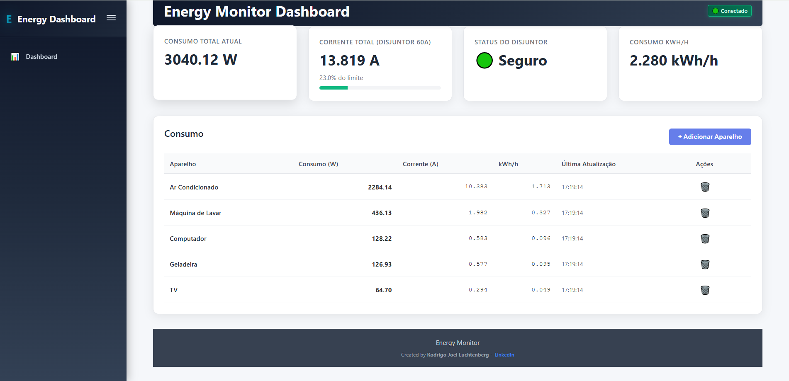

# Energy Monitor Dashboard



Sistema de monitoramento de consumo de energia em tempo real desenvolvido com .NET 9 e React.

## Quick Start com Docker

### Pré-requisitos
- Docker
- Docker Compose

### Executar o projeto
```bash
# Clone o repositório
git clone [seu-repositorio]
cd energy-dashboard

# Execute com Docker
docker-compose up

# Ou em background
docker-compose up -d
```

**Acesse:**
- Frontend: http://localhost:3000
- Backend API: http://localhost:5010
- Swagger: http://localhost:5010/swagger

### Parar o projeto
```bash
docker-compose down
```

## Desenvolvimento Local (sem Docker)

### Pré-requisitos
- .NET 9 SDK
- Node.js 18+
- Yarn

### Backend
```bash
cd backend
dotnet restore
dotnet run
```

### Frontend
```bash
cd frontend
yarn install
yarn start
```

## Funcionalidades

- Monitoramento em tempo real do consumo de energia
- Dashboard com dados de consumo
- Gestão de aparelhos elétricos
- Cálculo automático de corrente e kWh/h
- Alertas de sobrecarga do disjuntor (60A)

## Arquitetura

### Backend (.NET 9)
- **ASP.NET Core Web API**
- **Entity Framework Core** com SQLite
- **SignalR** para comunicação em tempo real
- **Repository Pattern** e **Dependency Injection**
- **Cache em memória** para otimização

### Frontend (React + TypeScript)
- **React 18** com TypeScript
- **Hooks** para gerenciamento de estado
- **Axios** para comunicação com API
- **SignalR Client** para updates em tempo real

## Docker

- **Multi-stage builds** para otimização
- **Nginx** para servir o frontend
- **Volume** para persistência do banco SQLite
- **Docker Compose** para orquestração